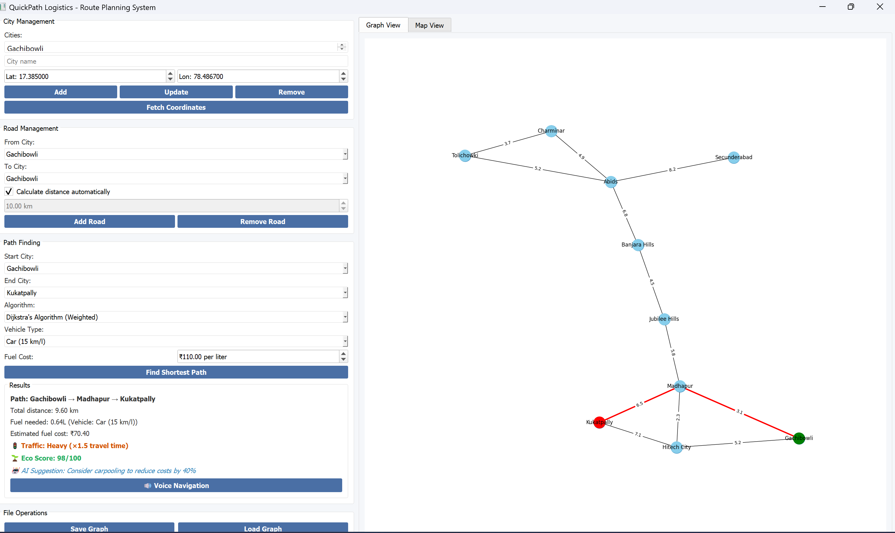

#  ZipZap – Smart Route Planner for QuickPath Logistics

**ZipZap** is a desktop-based intelligent logistics route planner made for the real streets of **Hyderabad**. It helps logistics companies find the shortest, most fuel-efficient paths between delivery points — using powerful algorithms and real-time insights.

---

##  Problem Statement
This project was developed for **QuickPath Logistics** to improve delivery efficiency using route optimization, fuel analysis, and AI-based route suggestions.

---

##  Features

-  Add or Remove Cities & Roads – Build your own map
-  Shortest Path Finder – Use **Dijkstra**, **BFS**, or **both**
-  Fuel Estimator – Select vehicle type to get fuel cost
-  Traffic Multiplier – Smart adjustment based on time (1x / 1.5x)
-  “AI-style” Suggestions – Shows cost, traffic level, eco score
-  Map View – Real-time marker updates
-  Graph Visualization – Clear visual of routes as graphs
-  Voice Navigation – Speaks out the route
-  Graph Save/Load – Export your custom map

---

##  Tech Stack

- Python
- Graph Algorithms (Dijkstra, BFS)
- Tkinter 
- Text-to-Speech (for voice navigation)
- Map & Graph libraries 

---
##  Demo Screenshots

###  Real-Time Map View
Shows the actual Hyderabad delivery points and current location on map.


---

###  Graph Visualization
Displays the delivery routes as a connected graph of cities and roads.




##  How to Run Locally

```bash
# Clone the repo
git clone https://github.com/Ramyasai07/zipzap-shortest-path-app.git

# Navigate to the project folder
cd zipzap-shortest-path-app

# Run the app
python ZipZap.py


